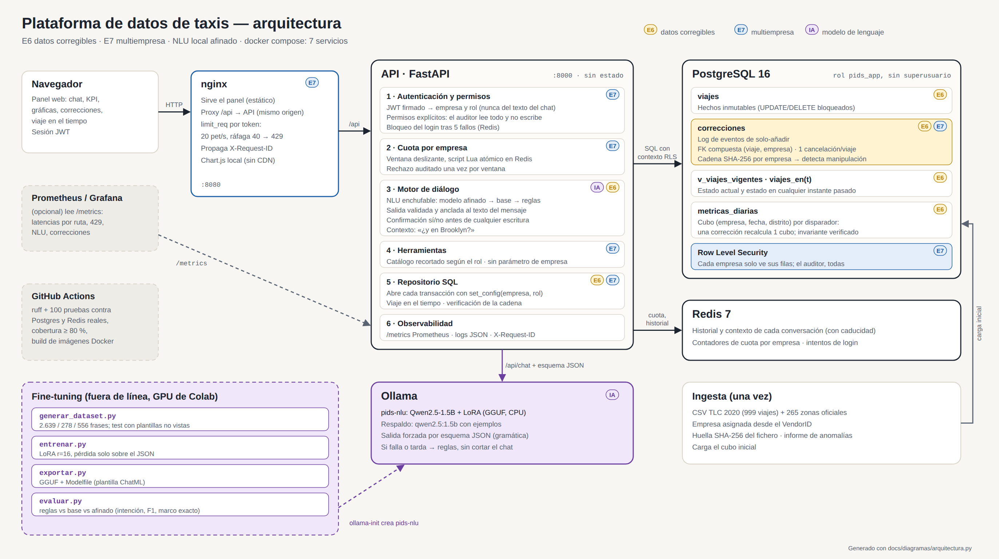

# Arquitectura de la plataforma

## Visión general



El diagrama se genera desde código (`docs/diagramas/arquitectura.py`): si cambia
la arquitectura, se edita el script y se regenera. Las decisiones que hay detrás
de cada caja están en los [ADR](adr/).

## Componentes del chatbot

Siguiendo el esquema de agente conversacional de la asignatura:

| Componente del esquema | Dónde está | Qué hace aquí |
|---|---|---|
| Interfaz de usuario | `web/index.html` (servido por nginx) | Chat con confirmaciones Sí/No, gráficas y formulario de correcciones |
| NLU (intención y entidades) | `nlu_llm.py` (Ollama) / `nlu.py` | Modelo local Qwen2.5 afinado con LoRA que devuelve un JSON con esquema forzado; reglas como respaldo |
| Gestión del diálogo | `motor.py` + Redis | Bucle de herramientas, historial, contexto para preguntas de seguimiento y confirmación de escrituras |
| Acciones | `herramientas.py` | Catálogo de funciones, recortado por rol |
| Acceso a datos | `repositorio.py` | SQL con contexto de empresa |
| Base de conocimiento | `zonas` en Postgres | Catálogo de las 265 zonas oficiales de NYC |
| Integración | `main.py` | API HTTP con JWT y cuotas |

## Elección de tecnologías

### PostgreSQL como almacenamiento principal

Lo decisivo fue el **Row Level Security nativo**. Es lo que permite que el
aislamiento entre empresas (E7) viva en el motor y no solo en el código de la
aplicación. MongoDB o MySQL habrían obligado a confiar exclusivamente en que
ningún desarrollador olvide un filtro.

El segundo motivo es que las métricas de este escenario son agregaciones
relacionales sencillas sobre un esquema estable; no hay nada aquí que pida un
motor documental o columnar con este volumen.

### Redis como segundo almacenamiento

Dos usos, ambos mal encajados en Postgres:

- **Historial de conversación**: estado efímero con caducidad automática. No
  tiene sentido castigar la base de datos analítica con una escritura por cada
  turno de chat.
- **Contadores de cuota** (E7): necesitan operaciones atómicas de incremento y
  caducidad, que es exactamente para lo que sirve un `sorted set` de Redis.
  La comprobación y el consumo van en un script Lua, que Redis ejecuta de
  forma atómica: con peticiones simultáneas nunca se concede más de la cuota.

Tener dos almacenamientos con responsabilidades distintas responde además al
criterio de *"incluya varias opciones de almacenamiento"*.

### FastAPI

Validación automática de entradas con Pydantic, documentación interactiva
generada sola (`/docs`, que sirve de prueba de concepto de la API sin escribir
un cliente), y un sistema de dependencias que encaja bien con la comprobación de
permiso: `Depends(exigir_permiso("corregir"))` se lee como lo que hace.

### Modelo local afinado como NLU (versión 4)

El chatbot usa un modelo pequeño (Qwen2.5-1.5B) servido por **Ollama** y
afinado con LoRA para esta plataforma. Su único trabajo es convertir la frase
en un JSON validado (intención y entidades). Los permisos, las confirmaciones
y las cifras siguen en el código y en la base de datos. Motivos, alternativas
descartadas, dataset, entrenamiento y evaluación: [`llm/README.md`](../llm/README.md).

- **Por qué local:** los datos de las empresas no salen de la plataforma, no
  hay coste por mensaje y la demo no depende de la red. Encaja con E7.
- **Por qué afinado:** con frases que no ha visto, el NLU por reglas acierta
  el 65 % de las intenciones. Un modelo pequeño generaliza mejor a paráfrasis
  tras un entrenamiento corto, y sigue corriendo en CPU.
- **Por qué solo NLU:** un modelo de 1,5B no es fiable encadenando
  herramientas ni redactando cifras. Como extractor con salida estructurada
  sí lo es, y su salida se puede verificar.

### LLM con *function calling* (opción `anthropic`), con respaldo por reglas

Frente a Rasa o DialogFlow:

- **DialogFlow** se descartó por ser un servicio externo gestionado: obliga a
  depender de una cuenta de Google y complica desplegar todo con un solo
  `docker compose up`.
- **Rasa** es una opción sólida y auto-alojada, pero exige entrenar un modelo de
  intenciones con ejemplos de frases; para un dominio de diez funciones bien
  definidas, el *function calling* llega al mismo sitio sin mantener un conjunto
  de entrenamiento.
- **LLM con function calling** permite además que el modelo encadene varias
  llamadas (*"compara la tarifa media de Manhattan con la de Brooklyn"*) sin que
  haya que declarar ese flujo de antemano.

El **modo reglas** no es un plan B improvisado: comparte exactamente el mismo
catálogo de herramientas y la misma capa de datos, así que la plataforma
responde con o sin LLM. Cubre el riesgo real de que la demostración dependa de
un servicio de pago externo.

### El modo reglas, en detalle

Sin LLM, `nlu.py` extrae intención y entidades con expresiones regulares sobre
el texto normalizado (minúsculas, sin tildes, siempre por palabra completa) y
`motor.py` gestiona el diálogo con un pequeño estado en Redis:

- **Contexto:** la última consulta y sus filtros. *«Zonas con más viajes»* →
  *«¿y en Brooklyn?»* repite la consulta de zonas filtrando por distrito.
- **Fechas:** *«el 1 de enero»*, *«31/12/2019»*, *«nochevieja»*. Si falta el
  año se elige el de los datos (2020), no el actual.
- **Escrituras con confirmación:** *«el viaje 411 tenía mal la tarifa, eran
  23,50»* no escribe nada: previsualiza el cambio (valor vigente → nuevo, motivo)
  y lo deja pendiente hasta que el usuario responde *sí*. Cualquier otra
  respuesta lo descarta. Es la misma regla que se le da al LLM en sus
  instrucciones: una corrección es permanente, así que se confirma antes.

## Despliegue

Siete servicios en `docker-compose.yml`, con dependencias declaradas por estado
de salud para que el arranque sea determinista (más `ollama` y `ollama-init`,
que instala el modelo y termina; la API no los espera):

```
db ──(healthy)──► ingesta ──(completed)──► api ──► web (nginx)
cache ──(healthy)───────────────────────────┘
```

El navegador solo habla con nginx: sirve el panel y reenvía `/api/*` a la API
por la red interna. Postgres y Redis no publican puertos al equipo anfitrión.

La API espera a que la ingesta **termine correctamente**
(`service_completed_successfully`), no solo a que arranque. Así nunca se
levanta contra una base de datos a medio cargar, que es la causa típica de que
un `docker compose up` falle de forma intermitente.

El contenedor de la API declara además un `HEALTHCHECK` contra `/salud`, que
comprueba Postgres y Redis por separado y devuelve `503` si alguno falla.

## Alta disponibilidad

La prueba de concepto corre con una instancia de cada servicio. Los puntos
preparados para escalar, si hiciera falta justificarlo:

- La API **no guarda estado**: el historial vive en Redis y la identidad en el
  JWT. Se pueden levantar N réplicas detrás de un balanceador sin más cambios.
- Las cuotas son compartidas en Redis, así que el límite por empresa sigue
  siendo correcto con varias réplicas de API.
- Postgres admite réplicas de solo lectura; las consultas de métricas, que son
  la mayoría, podrían dirigirse a ellas.
